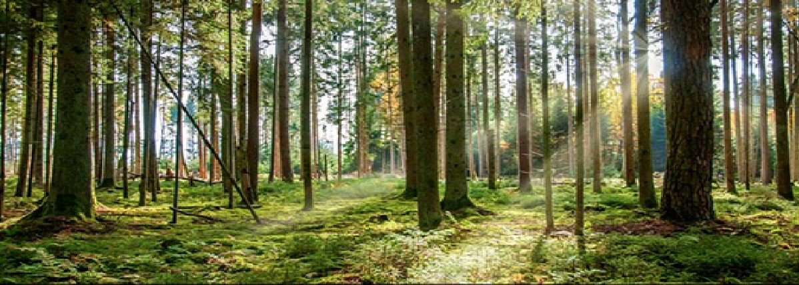

# Forest Cover Type Prediction



## 🎯 Objective

Build a system that can predict the type of forest cover using analysis data for a 30 m × 30 m patch of land in the forest.

<br/>

## 📊 Dataset

This dataset is an analysis dataset from the forest department performed in the Roosevelt National Forest of northern Colorado.


#### Integer Classification of Forest Cover Types

| Code | Cover Type        |
| :--: | :---------------- |
|   1  | Spruce/Fir        |
|   2  | Lodgepole Pine    |
|   3  | Ponderosa Pine    |
|   4  | Cottonwood/Willow |
|   5  | Aspen             |
|   6  | Douglas-fir       |
|   7  | Krummholz         |

<Br/>

### 📋 Description of Main Columns

| Column                                 | Description                                                  |
| :------------------------------------- | :----------------------------------------------------------- |
| Elevation                              | Elevation in meters.                                         |
| Aspect                                 | Aspect in degrees azimuth (0° = north, 90° = east, etc.).    |
| Slope                                  | Slope in degrees.                                            |
| Horizontal\_Distance\_To\_Hydrology    | Horizontal distance to nearest surface water features (m).   |
| Vertical\_Distance\_To\_Hydrology      | Vertical distance to nearest surface water features (m).     |
| Horizontal\_Distance\_To\_Roadways     | Horizontal distance to nearest roadway (m).                  |
| Hillshade\_9am                         | Hillshade index at 9 AM on summer solstice (0–255).          |
| Hillshade\_Noon                        | Hillshade index at noon on summer solstice (0–255).          |
| Hillshade\_3pm                         | Hillshade index at 3 PM on summer solstice (0–255).          |
| Horizontal\_Distance\_To\_Fire\_Points | Horizontal distance to nearest wildfire ignition points (m). |
| Wilderness\_Area1…4                    | Four binary flags (0 = absence, 1 = presence) for each       |
|                                        | designated wilderness area.                                  |
| Soil\_Type1…40                         | Forty binary flags (0 = absence, 1 = presence) for each soil |
|                                        | type designation.                                            |
| Cover\_Type                            | Target variable (1–7) indicating the forest cover type.      |


<br/>

## 🚀 Prerequisites
### Python Environment:

* Python 3.12 or later
* Conda (recommended for environment management)

<br/>

## 💻 Installation
#### 1. Create and Activate Environment:
```bash
conda create -p ml_venv python==3.12 -y
conda activate ml_venv
```

#### 2. Install Dependencies:
```bash
pip install -r requirements.txt
```

<br/>

## 🤖 Models and Evaluation
#### Tested models
- Logistic Regression
- Decision tree
- Random Forest
- Ada Boost

#### Fine Tuning
* Grid Search CV

#### Final model
Stacking Classifier (Logistic Regression, Decision tree, Random Forest, Ada Boost)

<br/>

### ✅ Evaluation
Result for **test** dataset
|       Class      | Precision | Recall | F1‑score | Support |
| :--------------: | :-------: | :----: | :------: | :-----: |
|         1        |    0.77   |  0.81  |   0.79   |   216   |
|         2        |    0.74   |  0.69  |   0.71   |   216   |
|         3        |    0.82   |  0.88  |   0.85   |   216   |
|         4        |    0.96   |  0.98  |   0.97   |   216   |
|         5        |    0.91   |  0.93  |   0.92   |   216   |
|         6        |    0.88   |  0.83  |   0.85   |   216   |
|         7        |    0.97   |  0.95  |   0.96   |   216   |
|   **Accuracy**   |     —     |    —   | **0.87** |   1512  |
|   **Macro avg**  |    0.87   |  0.87  |   0.87   |   1512  |
| **Weighted avg** |    0.87   |  0.87  |   0.87   |   1512  |


<br/>

## 📝 License
This project is under [MIT licences](../LICENSE) <br/>
[MIT](../LICENSE) © [Amaresh Maity](https://github.com/amareshmaity)